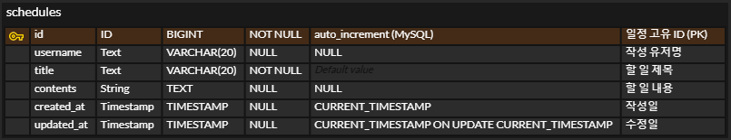

# SchedulerProject-dev

## Lv1. API & ERD

### API: 일정 CRUD

| 기능    | Method   | URL             |
|-------|----------|-----------------|
| 일정 등록 | `POST`   | /schedules      |
| 전체 조회 | `GET`    | /schedules      |
| 단건 조회 | `GET`    | /schedules/{id} |
| 일정 수정 | `PUT`    | /schedules/{id} |
| 일정 삭제 | `DELETE` | /schedules/{id} |

<details>
<summary>일정 등록 API</summary>

#### [개요]

- **URL**: `/schedules`
- **HTTP METHOD**: `POST`
- **설명**: 일정을 생성하는 API입니다.

#### [요청]

- `Headers`: 없음
- `Param`: 없음
- `Body`:

  | 키         | 데이터 타입 | 설명        | 필수값 |
      |------------|--------------|-------------|--------|
  | `title`     | `String`        | 일정 제목    | Y      |
  | `username`  | `String`        | 사용자 이름  | Y      |

- 예시
    ```json
    {
      "title": "공부하기",
      "username": "dilee"
    }
    ```

#### [응답]

- 성공
    - 설명

      | 키               | 타입     | 설명     |
      | --------------- | ------ | ------ |
      | `status`        | `int`    | 상태 코드  |
      | `data.id`       | `Long`   | 일정 ID  |
      | `data.title`    | `String` | 일정 제목  |
      | `data.username` | `String` | 사용자 이름 |

    - 예시
        ```json
        {
          "status": 200,
          "data": {
            "id": 1,
            "title": "공부하기",
            "username": "dilee"
          }
        }
       ```
- 실패
    - 설명

      | 키         | 타입     | 설명     |
      | --------- | ------ | ------ |
      | `status`  | `int`    | 상태 코드  |
      | `message` | `String` | 에러 메시지 |

    - 예시
        ```json
        {
          "status": 400,
          "message": "필수값이 누락되었습니다."
        }
        ```

</details>


<details>
<summary>전체 조회 API</summary>

#### [개요]

- **URL**: `/schedules`
- **HTTP METHOD**: `GET`
- **설명**: 모든 일정을 조회하는 API입니다.

#### [요청]

- `Headers`: 없음
- `Param` / `Body`: 없음

#### [응답]

- 성공
    - 설명

      | 키                 | 타입     | 설명     |
      | ----------------- | ------ | ------ |
      | `status`          | `int`    | 상태 코드  |
      | `data[].id`       | `Long`   | 일정 ID  |
      | `data[].title`    | `String` | 일정 제목  |
      | `data[].username` | `String` | 사용자 이름 |

    - 예시
        ```json
        {
          "status": 200,
          "data": [
            {
              "id": 1,
              "title": "공부하기",
              "username": "dilee"
            },
            {
              "id": 2,
              "title": "운동하기",
              "username": "dilee"
            }
          ]
        }
        ```

- 실패
    - 설명

      | 키         | 타입     | 설명     |
      | --------- | ------ | ------ |
      | `status`  | int    | 상태 코드  |
      | `message` | String | 에러 메시지 |

    - 예시
      ```json
        {
        "status": 500,
        "message": "서버 에러가 발생했습니다."
        }
      ```

</details>


<details>
<summary>단건 조회 API</summary>

#### [개요]

- **URL**: `/schedules/{id}`
- **HTTP METHOD**: `GET`
- **설명**: 특정 ID의 일정을 조회하는 API입니다.

#### [요청]

- `Headers`: 없음
- `Param`:
    - 설명

      | 키   | 데이터타입 | 설명         | 필수값 |
      |------|------------|--------------|--------|
      | `id`   | `Long`       | 일정 ID       | Y      |

    - 예시
      ```
      URL: /schedules/1
      ```

- `Body`: 없음

#### [응답]

- 성공
    - 설명

      | 키               | 타입     | 설명     |
      | --------------- | ------ | ------ |
      | `status`        | `int`    | 상태 코드  |
      | `data.id`       | `Long`   | 일정 ID  |
      | `data.title`    | `String` | 일정 제목  |
      | `data.username` | `String` | 사용자 이름 |

    - 예시

        ```json
        {
          "status": 200,
          "data": {
            "id": 1,
            "title": "공부하기",
            "username": "dilee"
          }
        }
        ```
- 실패
    - 설명

      | 키         | 타입     | 설명     |
      | --------- | ------ | ------ |
      | `status`  | `int`    | 상태 코드  |
      | `message` | `String` | 에러 메시지 |

    - 예시
      ```json
      {
        "status": 404,
        "message": "해당 ID의 일정을 찾을 수 없습니다."
      }
      ```

</details>


<details>
<summary>일정 수정 API</summary>

- **URL**: `/schedules/{id}`
- **HTTP METHOD**: `PUT`
- **설명**: 일정 ID에 해당하는 일정을 수정하는 API입니다.

---

#### [요청]

- `Headers`: 없음

- `Param`:
    - 설명

      | 키   | 데이터타입 | 설명     | 필수값 |
      |------|------------|----------|--------|
      | `id`   | `Long`       | 일정 ID  | Y      |

    - 예시
      ```
      URL: /schedules/1
      ```

- `Body`:
    - 설명

      | 키       | 데이터타입 | 설명     | 필수값 |
      |----------|------------|----------|--------|
      | `title`    | `String`     | 일정 제목 | Y      |
      | `username` | `String`     | 사용자명  | Y      |
      | `contents` | `String`     | 일정 내용 | Y      |

    - 예시
      ```json
      {
        "title": "스터디 모임",
        "username": "dilee",
        "contents": "자바 스터디 회의"
      }
      ```

---

#### [응답]

- 성공
    - 설명

      | 키   | 데이터타입 | 설명         |
      |------|------------|--------------|
      | `data` | `Object`     | 수정된 일정 데이터 |

    - 예시
      ```json
      {
        "status": 200,
        "data": {
          "id": 1
        }
      }
      ```

- 실패
    - 설명

      | 키     | 데이터타입 | 설명         |
      |--------|------------|--------------|
      | `status` | `int`        | 상태 코드     |
      | `message`| `String`     | 에러 메시지   |

    - 예시
      ```json
      {
        "status": 400,
        "message": "에러가 발생했습니다."
      }
      ```

</details>


<details>
<summary>일정 삭제 API</summary>

- **URL**: `/schedules/{id}`
- **HTTP METHOD**: `DELETE`
- **설명**: 일정 ID에 해당하는 일정을 삭제하는 API입니다.

---

#### [요청]

- `Headers`: 없음
- `Param`:
    - 설명

      | 키   | 데이터타입 | 설명     | 필수값 |
      |------|------------|----------|--------|
      | `id`   | `Long`       | 일정 ID  | Y      |

    - 예시
      ```
      URL: /schedules/1
      ```

- `Body`: 없음

---

#### [응답]

- 성공

    - 설명

      | 키   | 데이터타입 | 설명         |
      |------|------------|--------------|
      | `data` | `Object`     | 삭제된 일정 정보 |

    - 예시
      ```json
      {
        "status": 200,
        "data": {
          "id": 1
        }
      }
      ```

- 실패
    - 설명

      | 키     | 데이터타입 | 설명         |
      |--------|------------|--------------|
      | `status` | `int`        | 상태 코드     |
      | `message`| `String`     | 에러 메시지   |

    - 예시
      ```json
      {
        "status": 400,
        "message": "에러가 발생했습니다."
      }
      ```

</details>

---

### ERD: `schedules`
