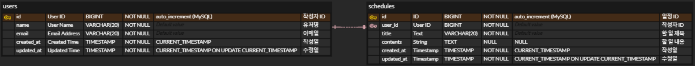
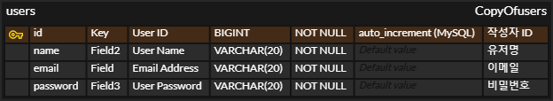

# SchedulerProject-dev

<details>
<summary>Lv1. Schedule</summary>

## ⬥ API: 일정 CRUD

| 기능    | Method   | URL             |
|-------|----------|-----------------|
| 일정 등록 | `POST`   | /schedules      |
| 전체 조회 | `GET`    | /schedules      |
| 단건 조회 | `GET`    | /schedules/{id} |
| 일정 수정 | `PUT`    | /schedules/{id} |
| 일정 삭제 | `DELETE` | /schedules/{id} |

<details>
<summary>일정 등록 API</summary>

#### [개요]

- **URL**: `/schedules`
- **HTTP METHOD**: `POST`
- **설명**: 일정을 생성하는 API입니다.

#### [요청]

- `Headers`: 없음
- `Param`: 없음
- `Body`:

  | 키         | 데이터 타입 | 설명        | 필수값 |
  |------------|--------------|-------------|--------|
  | `title`     | `String`        | 일정 제목    | Y      |
  | `username`  | `String`        | 사용자 이름  | Y      |

- 예시
    ```json
    {
      "title": "공부하기",
      "username": "dilee"
    }
    ```

#### [응답]

- 성공
    - 설명

      | 키               | 타입     | 설명     |
      | --------------- | ------ | ------ |
      | `status`        | `int`    | 상태 코드  |
      | `data.id`       | `Long`   | 일정 ID  |
      | `data.title`    | `String` | 일정 제목  |
      | `data.username` | `String` | 사용자 이름 |

    - 예시
        ```json
        {
          "status": 200,
          "data": {
            "id": 1,
            "title": "공부하기",
            "username": "dilee"
          }
        }
       ```
- 실패
    - 설명

      | 키         | 타입     | 설명     |
      | --------- | ------ | ------ |
      | `status`  | `int`    | 상태 코드  |
      | `message` | `String` | 에러 메시지 |

    - 예시
        ```json
        {
          "status": 400,
          "message": "필수값이 누락되었습니다."
        }
        ```

</details>


<details>
<summary>전체 조회 API</summary>

#### [개요]

- **URL**: `/schedules`
- **HTTP METHOD**: `GET`
- **설명**: 모든 일정을 조회하는 API입니다.

#### [요청]

- `Headers`: 없음
- `Param` / `Body`: 없음

#### [응답]

- 성공
    - 설명

      | 키        | 타입           | 설명               |
      |----------|----------------|--------------------|
      | `status` | `int`          | 상태 코드          |
      | `data`   | `List<Object>` | 일정 객체 리스트   |

        - 각 일정 객체(`data[]`)의 필드:

          | 키                 | 타입     | 설명         |
          |-------------------|----------|--------------|
          | `id`              | `Long`   | 일정 ID      |
          | `title`           | `String` | 일정 제목     |
          | `username`        | `String` | 사용자 이름   |

    - 예시
        ```json
        {
          "status": 200,
          "data": [
            {
              "id": 1,
              "title": "공부하기",
              "username": "dilee"
            },
            {
              "id": 2,
              "title": "운동하기",
              "username": "dilee"
            }
          ]
        }
        ```

- 실패
    - 설명

      | 키         | 타입     | 설명     |
      | --------- | ------ | ------ |
      | `status`  | int    | 상태 코드  |
      | `message` | String | 에러 메시지 |

    - 예시
      ```json
      {
      "status": 500,
      "message": "서버 에러가 발생했습니다."
      }
      ```
</details>


<details>
<summary>단건 조회 API</summary>

#### [개요]

- **URL**: `/schedules/{id}`
- **HTTP METHOD**: `GET`
- **설명**: 특정 ID의 일정을 조회하는 API입니다.

#### [요청]

- `Headers`: 없음
- `Param`:
    - 설명

      | 키   | 데이터타입 | 설명         | 필수값 |
      |------|------------|--------------|--------|
      | `id`   | `Long`       | 일정 ID       | Y      |

    - 예시
      ```
      URL: /schedules/1
      ```

- `Body`: 없음

#### [응답]

- 성공
    - 설명

      | 키               | 타입     | 설명     |
      | --------------- | ------ | ------ |
      | `status`        | `int`    | 상태 코드  |
      | `data.id`       | `Long`   | 일정 ID  |
      | `data.title`    | `String` | 일정 제목  |
      | `data.username` | `String` | 사용자 이름 |

    - 예시

        ```json
        {
          "status": 200,
          "data": {
            "id": 1,
            "title": "공부하기",
            "username": "dilee"
          }
        }
        ```
- 실패
    - 설명

      | 키         | 타입     | 설명     |
      | --------- | ------ | ------ |
      | `status`  | `int`    | 상태 코드  |
      | `message` | `String` | 에러 메시지 |

    - 예시
      ```json
      {
        "status": 404,
        "message": "해당 ID의 일정을 찾을 수 없습니다."
      }
      ```

</details>


<details>
<summary>일정 수정 API</summary>

- **URL**: `/schedules/{id}`
- **HTTP METHOD**: `PUT`
- **설명**: 일정 ID에 해당하는 일정을 수정하는 API입니다.

---

#### [요청]

- `Headers`: 없음

- `Param`:
    - 설명

      | 키   | 데이터타입 | 설명     | 필수값 |
      |------|------------|----------|--------|
      | `id`   | `Long`       | 일정 ID  | Y      |

    - 예시
      ```
      URL: /schedules/1
      ```

- `Body`:
    - 설명

      | 키       | 데이터타입 | 설명     | 필수값 |
      |----------|------------|----------|--------|
      | `title`    | `String`     | 일정 제목 | Y      |
      | `username` | `String`     | 사용자명  | Y      |
      | `contents` | `String`     | 일정 내용 | Y      |

    - 예시
      ```json
      {
        "title": "스터디 모임",
        "username": "dilee",
        "contents": "자바 스터디 회의"
      }
      ```

---

#### [응답]

- 성공
    - 설명

      | 키   | 데이터타입 | 설명         |
      |------|------------|--------------|
      | `data` | `Object`     | 수정된 일정 데이터 |

    - 예시
      ```json
      {
        "status": 200,
        "data": {
          "id": 1
        }
      }
      ```

- 실패
    - 설명

      | 키     | 데이터타입 | 설명         |
      |--------|------------|--------------|
      | `status` | `int`        | 상태 코드     |
      | `message`| `String`     | 에러 메시지   |

    - 예시
      ```json
      {
        "status": 400,
        "message": "에러가 발생했습니다."
      }
      ```

</details>


<details>
<summary>일정 삭제 API</summary>

- **URL**: `/schedules/{id}`
- **HTTP METHOD**: `DELETE`
- **설명**: 일정 ID에 해당하는 일정을 삭제하는 API입니다.

---

#### [요청]

- `Headers`: 없음
- `Param`:
    - 설명

      | 키   | 데이터타입 | 설명     | 필수값 |
      |------|------------|----------|--------|
      | `id`   | `Long`       | 일정 ID  | Y      |

    - 예시
      ```
      URL: /schedules/1
      ```

- `Body`: 없음

---

#### [응답]

- 성공

    - 설명

      | 키   | 데이터타입 | 설명         |
      |------|------------|--------------|
      | `data` | `Object`     | 삭제된 일정 정보 |

    - 예시
      ```json
      {
        "status": 200,
        "data": {
          "id": 1
        }
      }
      ```

- 실패
    - 설명

      | 키     | 데이터타입 | 설명         |
      |--------|------------|--------------|
      | `status` | `int`        | 상태 코드     |
      | `message`| `String`     | 에러 메시지   |

    - 예시
      ```json
      {
        "status": 400,
        "message": "에러가 발생했습니다."
      }
      ```

</details>

## ⬥ ERD: `schedules`


</details>

<details>
<summary>Lv2. User</summary>

### ⬥ API: 유저 CRUD

| 기능    | Method | URL         |
| ----- | ------ | ----------- |
| 유저 등록 | `POST`   | /users      |
| 전체 조회 | `GET`    | /users      |
| 단건 조회 | `GET`    | /users/{id} |
| 유저 수정 | `PUT`    | /users/{id} |
| 유저 삭제 | `DELETE` | /users/{id} |

<details>
  <summary>유저 등록 API</summary>

  - **URL**: `/users`
  - **HTTP METHOD**: `POST`
  - **설명**: 새로운 유저를 생성하는 API입니다.

#### [요청]

- `Headers`: 없음
- `Param`: 없음
- `Body`:

  | 키          | 데이터 타입   | 설명     | 필수값 |
  | ---------- | -------- | ------ | --- |
  | `username` | `String` | 유저명    | Y   |
  | `email`    | `String` | 이메일    | Y   |

- 예시
    ```json
    {
    "username": "dilee",
    "email": "dilee@email.com"
    }
    ```

#### [응답]

- 성공
    - 설명

      | 키               | 타입       | 설명    |
      | --------------- | -------- | ----- |
      | `status`        | `int`    | 상태 코드 |
      | `data.id`       | `Long`   | 유저 ID |
      | `data.username` | `String` | 유저명   |
      | `data.email`    | `String` | 이메일   |

    - 예시
        ```json
        {
          "status": 200,
          "data": {
            "id": 1,
            "username": "dilee",
            "email": "dilee@email.com"
          }
        }
       ```
- 실패
    - 설명

      | 키         | 타입       | 설명     |
      | --------- | -------- | ------ |
      | `status`  | `int`    | 상태 코드  |
      | `message` | `String` | 에러 메시지 |

    - 예시
        ```json
        {
          "status": 400,
          "message": "필수값이 누락되었습니다."
        }
        ```
</details>

<details>
  <summary>전체 조회 API</summary>

  - **URL**: `/users`
  - **HTTP METHOD**: `GET`
  - **설명**: 모든 유저 목록을 조회하는 API입니다.

#### [요청]

- `Headers`: 없음
- `Param`: 없음
- `Body`: 없음

#### [응답]

- 성공
    - 설명

      | 키        | 타입      | 설명    |
      | -------- | ------- | ----- |
      | `status` | `int`   | 상태 코드 |
      | `data`   | `Array` | 유저 목록 |

    - 예시
        ```json
        {
          "status": 200,
          "data": [
            {
              "id": 1,
              "username": "dilee",
              "email": "dilee@email.com"
            },
            {
              "id": 2,
              "username": "kim",
              "email": "kim@email.com"
            }
          ]
        }
       ```
- 실패
    - 설명

      | 키         | 타입       | 설명     |
      | --------- | -------- | ------ |
      | `status`  | `int`    | 상태 코드  |
      | `message` | `String` | 에러 메시지 |


  - 예시
      ```json
      {
        "status": 500,
        "message": "서버 오류로 유저 목록을 불러올 수 없습니다."
      }
      ```
</details>

<details>
  <summary>단건 조회 API</summary>

  - **URL**: `/users/{id}`
  - **HTTP METHOD**: `GET`
  - **설명**: ID로 유저를 조회하는 API입니다.

#### [요청]

- `Headers`: 없음
- `PathVariable`:

  | 키    | 타입     | 설명    |
  | ---- | ------ | ----- |
  | `id` | `Long` | 유저 ID |

- `Body`: 없음

#### [응답]

- 성공
    - 설명

      | 키               | 타입       | 설명    |
      | --------------- | -------- | ----- |
      | `status`        | `int`    | 상태 코드 |
      | `data.id`       | `Long`   | 유저 ID |
      | `data.username` | `String` | 유저명   |
      | `data.email`    | `String` | 이메일   |

    - 예시
        ```json
        {
          "status": 200,
          "data": {
            "id": 1,
            "username": "dilee",
            "email": "dilee@email.com"
          }
        }
       ```
- 실패
    - 설명

      | 키         | 타입       | 설명     |
      | --------- | -------- | ------ |
      | `status`  | `int`    | 상태 코드  |
      | `message` | `String` | 에러 메시지 |

    - 예시
        ```json
        {
          "status": 404,
          "message": "해당 유저를 찾을 수 없습니다."
        }
        ```
</details>

<details>
  <summary>유저 수정 API</summary>

  - **URL**: `/users/{id}`
  - **HTTP METHOD**: `PUT`
  - **설명**: 유저 정보를 수정하는 API입니다.

#### [요청]

- `Headers`: 없음
- `Param`: 없음
- `PathVariable`:

  | 키    | 타입     | 설명    |
  | ---- | ------ | ----- |
  | `id` | `Long` | 유저 ID |

- `Body`:

  | 키          | 타입       | 설명  | 필수값 |
  | ---------- | -------- | --- | --- |
  | `username` | `String` | 유저명 | Y   |
  | `email`    | `String` | 이메일 | Y   |

- 예시
    ```json
    {
      "username": "newname",
      "email": "new@email.com"
    }
    ```

#### [응답]

- 성공
    - 설명

      | 키         | 타입     | 설명    |
      | --------- | ------ | ----- |
      | `status`  | `int`  | 상태 코드 |
      | `data.id` | `Long` | 유저 ID |

    - 예시
        ```json
        {
          "status": 200,
          "data": {
            "id": 1
          }
        }
       ```
- 실패
    - 설명

      | 키         | 타입       | 설명     |
      | --------- | -------- | ------ |
      | `status`  | `int`    | 상태 코드  |
      | `message` | `String` | 에러 메시지 |

    - 예시
        ```json
        {
          "status": 400,
          "message": "입력값이 올바르지 않습니다."
        }
        ```
</details>

<details>
  <summary>유저 삭제 API</summary>

  - **URL**: `/users/{id}`
  - **HTTP METHOD**: `DELETE`
  - **설명**: 유저를 삭제하는 API입니다.

#### [요청]

- `Headers`: 없음
- `Param`: 없음
- `PathVariable`:

  | 키    | 타입     | 설명    |
  | ---- | ------ | ----- |
  | `id` | `Long` | 유저 ID |

- `Body`: 없음

#### [응답]

- 성공
    - 설명

      | 키         | 타입       | 설명        |
      | --------- | -------- | --------- |
      | `status`  | `int`    | 상태 코드     |
      | `message` | `String` | 삭제 완료 메시지 |

    - 예시
        ```json
        {
          "status": 200,
          "message": "유저가 삭제되었습니다."
        }
       ```
- 실패
    - 설명

      | 키         | 타입       | 설명     |
      | --------- | -------- | ------ |
      | `status`  | `int`    | 상태 코드  |
      | `message` | `String` | 에러 메시지 |

    - 예시
        ```json
        {
          "status": 404,
          "message": "삭제할 유저가 존재하지 않습니다."
        }
        ```
</details>

## ⬥ ERD: `users`


</details>

<details>
  <summary>Lv3. Authentication(인증)</summary>

## ⬥ API: 회원가입

| 기능   | Method | URL           |
| ---- | ------ | ------------- |
| 회원가입 | `POST` | /users/signup |

  <details>
    <summary>회원가입 API</summary>

#### [개요]
- **URL**: `/users/signup`
- **HTTP METHOD**: `POST`
- **설명**: 새로운 사용자를 등록하는 API입니다.

#### [요청]
- `Headers`: 없음
- `Param`: 없음
- `Body`:

  | 키         | 데이터 타입   | 설명       | 필수값 |
  | ---------- | -------- | -------- | --- |
  | `username` | `String` | 사용자 이름   | Y   |
  | `password` | `String` | 사용자 비밀번호 | Y   |

- 예시
  ```json
  {
    "username": "dilee",
    "password": "1234"
  }
  ```

#### [응답]
- 성공
  - 설명
  
    | 키       | 타입     | 설명          |
    |----------|----------|---------------|
    | `status` | `int`    | 상태 코드     |
    | `message`| `String` | 성공 메시지   |

  - 예시
      ```json
      {
        "status": 200,
        "message": "회원가입이 완료되었습니다."
      }
      ```
- 실패
  - 설명

    | 키       | 타입     | 설명          |
    |----------|----------|---------------|
    | `status` | `int`    | 상태 코드     |
    | `message`| `String` | 성공 메시지   |
  
  - 예시
    ```json
    {
      "status": 400,
      "message": "필수값이 누락되었습니다."
    }
    ```
  </details>
## ⬥ ERD: `users`

</details>

<details>
  <summary>Lv4. Authorization(인가)</summary>

  ## ⬥ API: 로그인 & 로그아웃
| 기능   | Method | URL     |
| ---- | ------ | ------- |
| 로그인  | `POST` | /login  |
| 로그아웃 | `POST` | /logout |

<details>
  <summary>로그인 API</summary>

  #### [개요]
  - **URL**: `/login`
  - **HTTP METHOD**: `POST`
  - **설명**: 이메일과 비밀번호를 이용해 로그인하는 API입니다.
              성공 시 세션에 사용자 정보를 저장합니다.

  #### [요청]
  - `Headers`: 없음
  - `Body`:

    | 키          | 타입     | 설명      | 필수 |
    | ---------- | ------ | ------- | -- |
    | `email`    | String | 로그인 이메일 | Y  |
    | `password` | String | 비밀번호    | Y  |

  - 예시
      ```json
      {
         "email": "test@example.com",
         "password": "1234"
      }
      ```

#### [응답]
- 성공
    - 상태코드: `200 OK`

    - 예시
        ```json
        {
          "status": 200,
          "message": "로그인되었습니다."
        }
        ```
- 실패
    - 상태코드: `401 Unauthorized`

    - 예시
      ```json
      {
        "status": 401,
        "message": "이메일 또는 비밀번호가 일치하지 않습니다."
      }
      ```
</details>

<details>
  <summary>로그아웃 API</summary>

#### [개요]
- **URL**: `/logout`
- **HTTP METHOD**: `POST`
- **설명**: 세션을 종료하여 로그아웃하는 API입니다.

#### [요청]
- `Headers`: Cookie 또는 세션 ID
- `Body`: 없음

#### [응답]
- 성공
    - 상태코드: `200 OK`

    - 예시
        ```json
        {
          "status": 200,
          "message": "로그아웃되었습니다."
        }
        ```
- 실패
    - 상태코드: `400 Unauthorized`

    - 예시
      ```json
      {
        "status": 400,
        "message": "이미 로그아웃된 상태입니다."
      }
      ```

## ⬥ ERD: `users`

</details>

</details>
